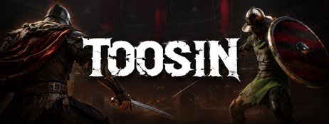
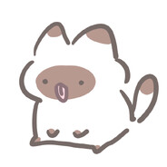
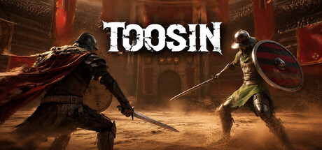
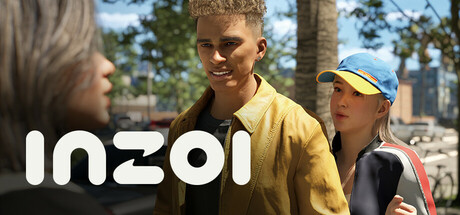
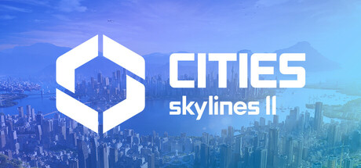
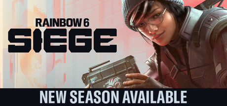
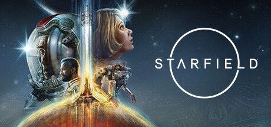
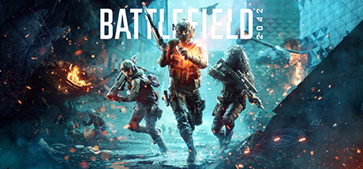

<h1 align="center">게임 클라이언트 개발자</h1>

  Unreal Engine 5와 C++을 중심으로 전투, 캐릭터, AI, UI·입력 시스템을 구현합니다. 
  1인 개발 게임의 Steam 출시·운영과 팀 프로젝트를 모두 경험했습니다.

  <code>Unreal Engine 5</code>
  <code>C++</code>
  <code>Unity</code>
  <code>C#</code>
  <code>Gameplay AI</code>
  <code>Multiplayer</code>

## 핵심 역량

| 분야 | 경험 |
| --- | --- |
| 게임플레이 | 캐릭터 상태, 근접 전투, 콤보, 피격·패링·회피, 무기 및 성장 시스템 |
| AI | Behavior Tree·Blackboard 기반 전투 AI, 플레이 패턴 분석, 난이도 적응 |
| UI·입력 | UMG, Enhanced Input, 키 리매핑, 키보드·마우스·Xbox 게임패드 대응 |
| 데이터·플랫폼 | SaveGame, Steamworks, 빌드·배포·업데이트, 장시간 플레이 안정화 |
| 멀티플레이 | Unreal Replication, Steam OSS, Photon, Firebase·PlayFab 연동 경험 |

## 대표 프로젝트

### TOOSIN : 투신

  

`Unreal Engine 5.5` `C++` `1인 개발` `Steam Early Access`

1대1 근접 전투 로그라이크입니다. 전투·AI·성장·저장·UI·게임패드 시스템을 직접 구현하고 Steam 빌드 배포와 업데이트를 진행했습니다.

- 공격·가드·패링·회피·콤보와 피격 반응을 포함한 전투 시스템
- 플레이 패턴을 분석하는 Behavior Tree 전투 AI와 적응형 난이도
- [Steam](https://store.steampowered.com/app/4635530/TOOSIN/) · [공개 개발 문서](https://github.com/rhwjdtjs/Toosin_Public) · [플레이 영상](https://youtu.be/nkfCGh1Q-rE)

### 그 외 프로젝트

| 프로젝트 | 기술 및 구현 | 링크 |
| --- | --- | --- |
| **VeloCore** | UE5·C++ 기반 고기동 멀티플레이 TPS, Replication·Steam OSS·Firebase | [GitHub](https://github.com/rhwjdtjs/Velocore) · [영상](https://youtu.be/35-OI47LQC0) |
| **Living Lonely** | Unity·C# 기반 오픈월드 생존 게임, HDRP·PlayFab 성장 데이터 | [GitHub](https://github.com/rhwjdtjs/Living_Lonely) · [영상](https://www.youtube.com/watch?v=qtte7avW9yM) |
| **Flight Fighter** | Unity·C# 기반 1대1 비행 전투, Photon 네트워크 | [GitHub](https://github.com/rhwjdtjs/Flight_Fighter) · [영상](https://youtu.be/Ya8GWlwHJAQ) |

## Steam 프로필

<table>
  <tr>
    <td width="92" align="center">
      
    </td>
    <td valign="middle">
      <strong>DEV_Meshami</strong> 
      플레이한 게임 · <a href="https://steamcommunity.com/profiles/76561199129005799">Steam 프로필 보기</a>
    </td>
  </tr>
</table>

<table>
  <tr>
    <td width="50%" align="center" valign="top">
       
      <strong>TOOSIN : 투신</strong>
    </td>
    <td width="50%" align="center" valign="top">
       
      <strong>inZOI</strong>
    </td>
  </tr>
  <tr>
    <td width="50%" align="center" valign="top">
       
      <strong>Cities: Skylines II</strong>
    </td>
    <td width="50%" align="center" valign="top">
       
      <strong>Tom Clancy's Rainbow Six Siege</strong>
    </td>
  </tr>
  <tr>
    <td width="50%" align="center" valign="top">
       
      <strong>Starfield</strong>
    </td>
    <td width="50%" align="center" valign="top">
       
      <strong>Battlefield 2042</strong>
    </td>
  </tr>
</table>

## 링크

- [GitHub](https://github.com/rhwjdtjs)
- [개발 기록](https://jeongseondevlog.tistory.com/)
- [TOOSIN 공개 개발 문서](https://github.com/rhwjdtjs/Toosin_Public)
